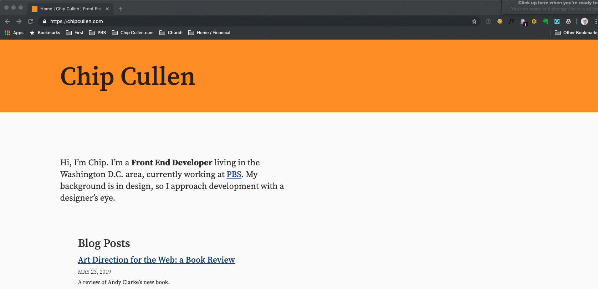

I have been a _longtime_ user of [Alfred App](https://www.alfredapp.com/) for the Mac. I wanted to share one of the simplest productivity enhancements that I use when it comes to my day to day.

It boils down to this - set up an [Alfred Workflow](https://www.alfredapp.com/workflows/) that simply launches a new browser window to some commonly used URL. Now, I can invoke Alfred, type a couple of characters, and then quickly access some web page.

You're probably going to go from a task that takes 5 or 6 seconds to one that takes 1-2 seconds. Which may not sound like a lot - but if it's something that you use all the time, this could save you a _lot_ of time over the long haul.

I don't know about you, but there are certain URLs that I access dozens of times a day. Can't think of any? What about some of these:

- Your currently active Sprint in JIRA (this is for me by far the most commonly used)
- The GitHub issues page for your project
- Your project's local development URL - `http://localhost:8000` or similar
- Regular videoconference standups, if accessed on the web
- Monitoring tool log / homepage
- Your build tool initialization page for your project
- Any web app that you use a lot (but resist the temptation for social media)

Once you have a URL in mind, you can then …

## Create a simple workflow

Workflows are an [Alfred Powerpack](https://www.alfredapp.com/powerpack/) feature, so you'll have to have a paid license. I feel that Alfred is far and away worth the price of a license.

Workflows _can_ be very complex, but this one will be very simple. Here is what you need to do:

1. Open Alfred's preferences
2. Click "Workflows" on the left hand side
3. At the bottom of the list click the "+" icon to create a new workflow
4. In the resulting popup, go "Templates > Web & URLs > Open Custom URL in Specified Browser"
5. Fill out the information in the workflow creation screen, as you see fit. It doesn't matter a whole lot, but I'd at least name it something easy to recognize so that you can tell it apart from other workflows.
   
6. You should now have a workflow in front of you that looks like this
   
7. In the workflow screen, double-click on the "keyword" tile, and in the resulting dialog specify a keyword that you would associate with your desired URL. I try to come up with something that is just two letters long, and easy to remember. Fill out a Title and subtext to help you remember what this URL is. **IMPORTANT**: Uncheck "with space" and select "No Argument" in the dropdown. If you have a small graphic file that fits, you can drop it in the "icon" box, too. Hit "Save".
   
8. Double-click on the "Open URL" tile, and pop your desired URL in the form field. Leave the "Browser" option set to "Default Browser" so that if you do switch default browsers, your workflow will still work.
   

... And that's it, really. Now you can invoke Alfred, type a couple letters, hit return, and get taken to a URL that you rely on to do your work.

I encourage you to think of the _most_ commonly accessed URLs you need for your work, and create similar workflows. You probably will only need 3 or 4, but will really start to appreciate the time this saves you.

Happy flying!
