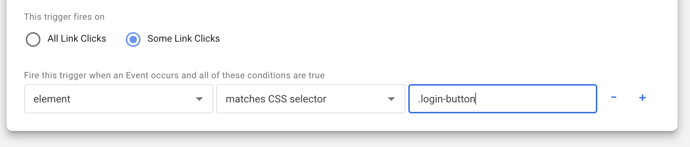

Client side taggers, such as [Google Tag Manger](https://marketingplatform.google.com/about/tag-manager/), allow you to use HTML selectors when pinpointing what UI elements you want to track.



If you do, you are subject to the danger of refactored code unintentionally breaking event tracking.

At my job, we have unintentionally broken analytics tracking in this way many times. The biggest problem here is the feedback loop. If a code refactor breaks a test, you're going to find out pretty soon. If you break analytics, it may be months (or years!) before anyone notices the drop off in data. And there is no way to get that data back - it's gone.
## What do you suggest?

The solution that we settled on is  _analytics specific_ classes that are a clear indicator to future developers that some HTML has analytics attached to it.

So, instead of this:

```html
<button class="login-button">Log In</button>
```

with an analytics tag looking for `.login-button`, we have:

```html
<button class="login-button an-12_1">Log In</button>
```

With `an-` indicating that there are analytics attached to the HTML element, and `12-1` corresponding to an agreed upon numbering system between devs and our analytics folks. For example, the login panel is `12.x` and this button is the first element in that panel. A second button might have `an-12_2` and so on. And those numbers correspond to tags/events set up in GTM. (Pro tip: we have a [big shared spreadsheet](https://www.google.com/sheets/about/) for these that keeps it all straight.)

The specifics here aren't all that important - it's more that you should have a agreed upon convention that is consistently applied.

## Benefits

A developer two years down the line, who is working on something like a rebrand of the site, will come across this login button and know right away that

- This button is being tracked in analytics
- It is event 12.1

Now they know that if they need to rework their code, this analytics class should carry over to whatever the new markup pattern is. Other developers looking at a diff in a pull request could also possibly spot where the class _hasn't_ been carried over, and point that out.

If the markup needs to change such that the HTML element is being removed altogether with no new equivelant, this will also allow a developer to know _which specific_ analytics events will stop working. They can proactively let others know that this is happening, rather than it being discovered much later.
## Full Credit - Ramona Schwering

[Ramona Schwering](https://twitter.com/leichteckig) wrote [this excellent article](https://www.smashingmagazine.com/2021/07/frontend-testing-pitfalls/) on common pitfalls in frontend testing on Smashing Magazine. I highly suggest reading the whole thing - there is a lot of great thoughts there, and I will be keeping them in mind when writing tests moving forward.

One pitfall she mentions specifically has to do with [tests that rely on selectors](https://www.smashingmagazine.com/2021/07/frontend-testing-pitfalls/#look-at-selectors-you-must) and how they are prone to breaking. If you have tests that look for particular HTML classes - e.g. `class="login-button"` - what happens when that button gets refactored? Your tests break, and it takes time to track down why. Very frustrating.

Ramona rightly suggests relying instead on test-specific data attributes that are clear signals in the code that something has a test written against it.

Her framing of that situation reminded me of what we do for our analytics events, which prompted this article.
