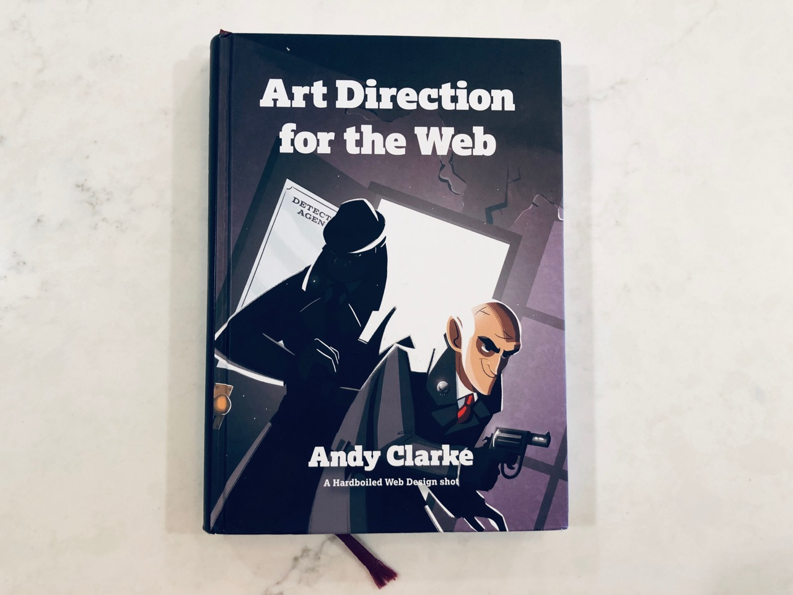
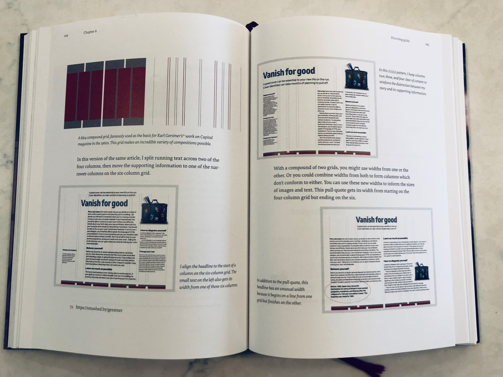
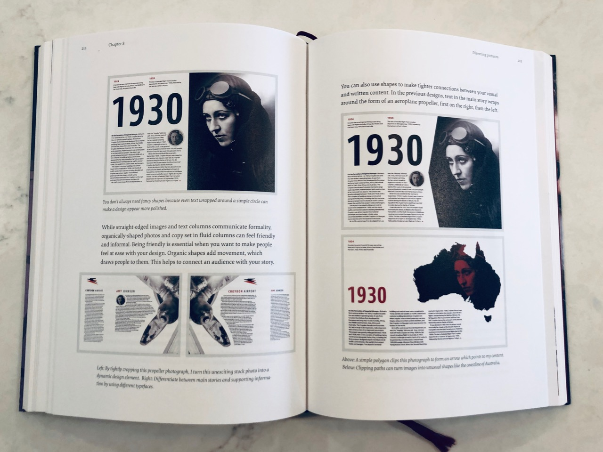
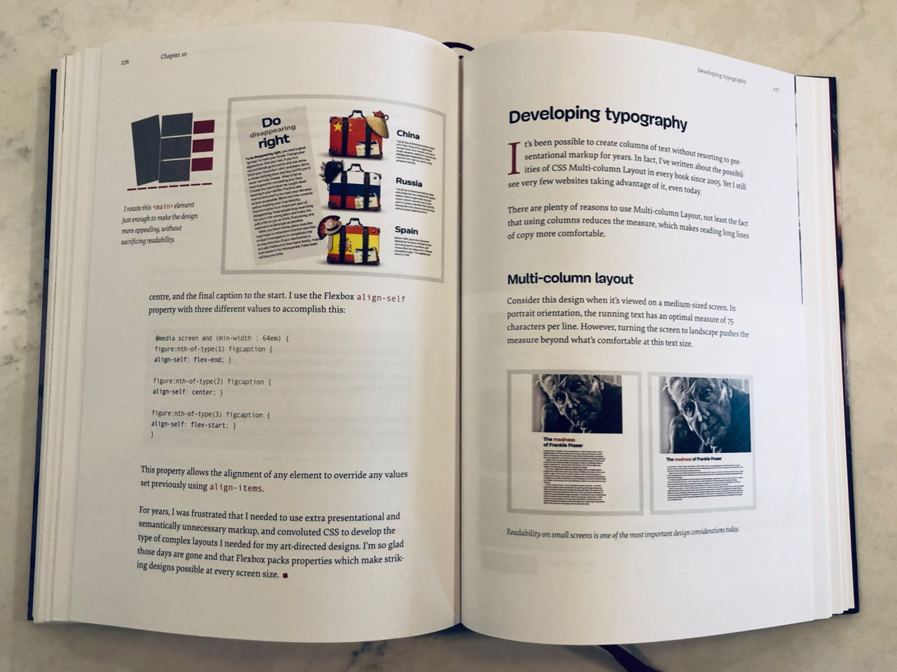


{{}}


Let's start this book review with a warning - I'm not about to be impartial. [Andy Clarke](https://stuffandnonsense.co.uk/) is a bit of a hero for me. His earlier work, [Transcending CSS](https://www.amazon.com/Transcending-CSS-Fine-Art-Design/dp/0321410971), is literally the book that started my career in web development. It is why, to this day, CSS is my comfort zone.

Needless to say, when I heard that he was working on a new book, and it was on a topic that I found _facinating_, I could hardly wait to get my hands on it.

([You can purchase it from Smashing Magazine here.](https://www.smashingmagazine.com/printed-books/art-direction-for-the-web/))

I have to say, it was worth the wait.

## The print edition

I opted to spring for the print edition of the book, and am very happy that I did. The production quality of the book is very high. Like other books that Smashing Magazine has produced, it has a very handy bookmark sewn into the spine. The paper feels like high quality stock, and the colors are vivid.

If you can, do purchase the print copy. You'll be glad that you did - given the very visually orientated nature of the content, having the physical book will make understanding the content so much easier.


{{}}


## Overall Structure

The book basically breaks down into three major parts:

1. Discussing what Art Direction actually _is_, why it matters, and some historical examples of it.
2. Going into how to approach Art Direction on the web in terms of _design_ - and some of the most significant design elements at your disposal. Specifically there is a focus on grids, typography and imagery.
3. Lastly, Andy Clarke covers developing for Art Direction, and here he covers CSS Grid, typography techniques, and new image treatment options now available to us in CSS.

All the while, he uses an example set of pages from a site about a fictional app which helps connect would be bank robbers with getaway drivers.

I found the overall flow of the book to be easy to follow - I never felt lost. It was clear to see, also, how an earlier piece would lead to a later piece.

## What is Art Direction?

The first section of the book tries to explain what art direction _is_ (because it's not a straight forward concept), and gives some prominent historical examples.

This is all done to laid the groundwork for Clarke's fundamental premise - that **design on the web has become too generic, too much the same, and there is no good reason for that.** We have tools at our disposal now that allow much more interesting design decisions, and we should embrace those possibilities.

Clarke puts forth that art direction is about understanding how you want to make a visitor/user of your site _feel_, and to think about how that can be expressed in terms of design. By making distinct design choices, you can make your product or site stand out and be memorable.


{{}}


## Diving into design

The next part of the book - and the meatiest - is a dive into design as it pertains to the web. Some of the early groundwork may be considered basic, but Clarke is also trying to explain the concepts to a wide audience. I for one appreciate the effort he put forth to build up context. You have to explain what a grid _is_ before you can go into the different kinds of grids.

### Grids

And there is a _lot_ of discussion about grids. For a good reason too - this is probably the single element of design on the web that has become so generic.

Clarke dives headlong into showing wildly different layout options - often using the same example content and showing it in different configurations. This gives you a sense of the impact that layout can have. You won't find a "hero image spanning the top of a page with three product icons in a row underneath" here.

I think this part really is the heart of the book - Clarke is really trying to get _everyone_ to think of all of the possibilities before us, rather than simply settling on conventions.

He then goes into two more areas of design - typography, and dealing with imagery.

### Typography

With typography, he shows the outwardly visible personality that different typefaces can give to content. One of the more interesting concepts for me in the entire book was that of **scale**. In typographic terms, _scale_ is the _ratio_ by which typefaces increase / decrease in size across elements.

If there are subtle jumps in size between, say, an `<h3>` and an `<h2>`, that would be said to have a shallower scale. If there is sharper increase in size, however, that is said to have a steeper scale.

This ratio will translate into a personality for your typography - a shallower scale is more restrained and conservative, while a steeper scale is more energetic and casual.

### Pictures

Clarke also delves into the different way imagery can be presented in our layouts. It's not just an image that we shove into an empty rectangle. Imagery needs to interact and balance with our written content. And they can interact in very interesting ways.

Here Clarke goes into examples of what I think are some of the most interesting layouts in the entire book. Half-up, full page height imagery that is arresting to the viewer.

I will also mention that I was very happy to see that in his examples, he showed not just a large desktop layout, but also how the same image could be used with intention across multiple breakpoints to maintain it's impact. This is the work of someone who really is considering the medium.


{{}}


## Developing for Art Direction

The last large section of the book was devoted to the actual technologies and techniques needed to bring the earlier design ideas to life. And here you see why he structured his design writing as he did.

### Layout techniques

Clarke spends quite a bit of time going over CSS Grid, and for good reason. CSS Grid is one of the most exciting advances in CSS in a long time, and it unlocks so much potential for design. We simply need to _use_ it. Clarke draws a connection between writing a CSS Grid layout in code, and how it produces one of his example layouts.

He also covers Flexbox, which still very much has a place in modern CSS layouts, even with the emergence of Grid. He even covers Column layout, which, I agree, is an underutilized technology.

### Typography techniques

When it comes to typography

### Picture techniques

This was also one of the more interesting sections of the book for me. I've heard

---

Total aside: a big thank you to [Laura Kalbag and her post on creating responsive images in Hugo](https://laurakalbag.com/processing-responsive-images-with-hugo/). I basically copied her code wholesale for use in my site. I have to say that it works quite well!
