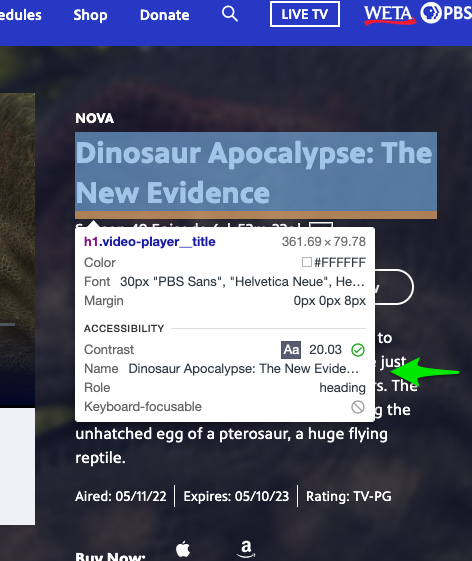

I was "today years old", as they say, when I stumbled across this feature in Chrome's [Dev Tools](https://developer.chrome.com/docs/devtools/). While you have Dev Tools open, if you hit **Command + Shift + C** (on Mac, I assume Ctrl + Shift + C on windows), you get this popover with lots of info as you hover over DOM elements:

## But wait, it gets better!

A coworker quickly pointed out that **Firefox has the same shortcut!**

At that point, I checked, and yep - **Safari also has this shortcut!**

## Differences

The information you get is between all three is a bit different. The versions in Firefox and Safari pretty much just show layout information. The Chrome version also includes some helpful accessibility information as well:

I don't know how I _didn't_ know about this super handy feature, but now I do! I hope it helps you!
