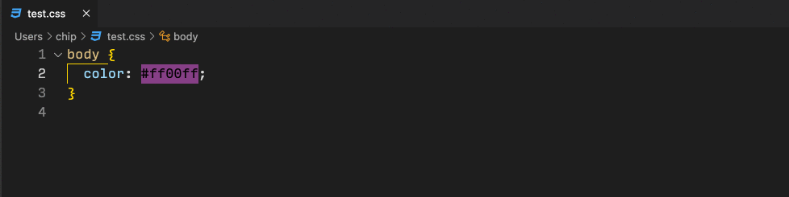

I launched [ColoRosetta](https://colorosetta.com/) a while ago now, to scratch an itch I've had for a long time. Namely, it was hard to get color translations for more than one color format at a time.

A little while ago, I got thinking about it - and what would _really_ be cool is if the color translation were available to me _in my editor_.

**[So, I made a VS Code Extension for it!](https://marketplace.visualstudio.com/items?itemName=chipcullen.colorosetta)**

You can translate selected text into 7 color formats: Hex (6), Hex (8), RGB, RGBa, HSL, HSLa and Named Colors.

You can install the extension right in VS Code - just look up "ColoRosetta" in the extension area.

If you find it useful - please leave a comment below!
