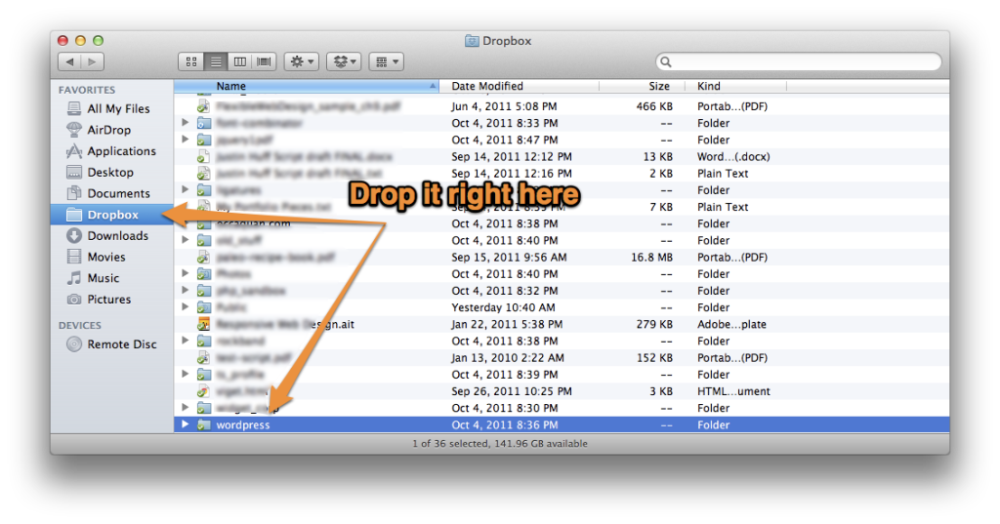
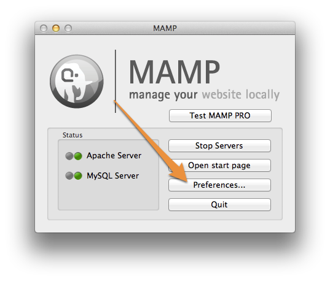
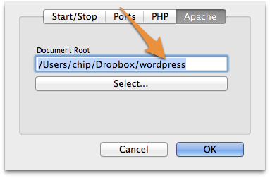

Let&rsquo;s say you want to develop a Wordpress site on your computer ( i.e., locally), but want to be able to work on that same site from a different computer. For instance, you are working on a site at work, but you have another computer at home, and want to easily work on the site from there.

To work on a site from two (or more) computers, you could constantly copy files back and forth, but the site content and configuration will not be the same. But you also don&rsquo;t want to work straight off a hosted server, as the lag of FTP'ing changes would be slow you down.

Using the method I&rsquo;m about to describe, you will be able to:

- Make changes to your theme files
- Add plugins
- Create/modify content
- Change site settings

And it will also **seamlessly transfer from one computer to another**.

<!--more-->

_I do not recommend this process for a group environment, as I explain later._

Some assumptions I&rsquo;m going to make up front:

- You&rsquo;ve installed a Wordpress site before, by hand, and are comfortable with the process (it&rsquo;s easy!)
- You&rsquo;re using a Mac. I work on a Mac, as does most of my audience, but the **same process should be possible on Windows**.
- You have a web hosting account already. If you are going down the rabbit hole I&rsquo;m about to show you, I&rsquo;m assuming you&rsquo;re the kind of person who does.
- You at least know what a mySQL database is, and that Wordpress runs on it, and you can at least get your web host account to create a new database.

### Let&rsquo;s get started

To achieve this, you will need a tasty cocktail of (mostly _free_) technologies that makes this easy. You need four things:

- A copy of Wordpress - [https://wordpress.org][1]
- A Dropbox account, along with the desktop app - [https://dropbox.com][2]
- MAMP - [https://mamp.info][3]
- A database that is hosted somewhere offsite - any decent webhost should offer mySQL databases and phpMyAdmin.

### Wordpress

Grab yourself a fresh copy of the latest copy of [Wordpress][1]. Download it onto your hard drive, and keep an eye on it. That Wordpress is shifty.

### Dropbox

This won&rsquo;t be a full introduction to [Dropbox][2] - the short version is that it&rsquo;s a way to keep files synced between computers and devices. Once you have an account, download the desktop app. This will install a directory on your computer that you can place files in that will sync with Dropbox.

Once you are set up, _drag your Wordpress directory into your Dropbox directory_. It may take a few minutes for the whole Wordpress folder to sync with Dropbox, but can continue to the next step anyway.

### MAMP (or WAMP for Windows)

[MAMP][3] is an indispensable utility that allows you to easily run a server environment on your computer. It lets you set up things like mySQL and PHP without having to deal with the command line.

This won&rsquo;t be a tutorial on [MAMP][3] (<a href="https://www.youtube.com/watch?v=EJFmogQVG8c">check out one here</a>), but once you have it up and running, you are ready to run Wordpress.

Here is the magic part: **you can run a Wordpress instance from _within_ a Dropbox folder**.

All you need to do is to point your MAMP Apache preferences to your Wordpress folder within Dropbox.

In the main MAMP window, click "Preferences", select the "Apache" tab, and under "Document Root", hit "Select&hellip;". In the dialog box, select your Wordpress folder from within Dropbox, and hit "okay". MAMP may prompt you for an administrator password.

### A Hosted Database

The last ingredient is an empty mySQL database available to you that is hosted somewhere on the internet. Most web hosts allow you to add new databases, and should have a database front end like phpMyAdmin. Once you create a database, you will need to have four pieces of information:

- The name of the database
- A user name that has privileges for that database
- That user&rsquo;s password
- The host name for the database - either a website&rsquo;s URL or an IP address

In you Wordpress directory, you will need to adjust the wp-config-sample.php file and adjust it with the above information, and save it as &ldquo;wp-config.php&rdquo;.

### Setting up your site

Now you&rsquo;re ready to start working on your Wordpress site. You will need to launch it first, so open your browser and go to:

[https://localhost:8888][4]

That URL basically points to your own machine (localhost), while using MAMP's port, 8888. You should see the Wordpress set up screen.

If you do, great! You&rsquo;re ready to rock. On the Wordpress set up screen, you will need to enter the database information that you have from your web host. Put that in, plus the normal Wordpress info, and you&rsquo;re good to go.

IF YOU DOn&rsquo;t SEE THE SETUP SCREEN: You probably are getting an error page saying &ldquo;Error establishing database connection&lsquo;. If you are, there are several things that could be at play. One, your web host&rsquo;s database may not be accessible from a remote location (in this case, your computer), so that port may not be exposed. It varies from host to host - you will need to check with them. The other issue could be your local firewall settings - if they are under your control, you may need to tweak which ports are exposed.

### Bringing it all together

So now you have Wordpress up and running on your computer. Sweet! Now, what to do about your _other_ computer?

On your second machine, you will need to install:

- [Dropbox][2]
- [MAMP][3]

When you have Dropbox installed, and are synced with your account, you will see the Dropbox folder has all the files that you put in it on your first computer. That includes the Wordpress directory.

When you have MAMP up and running on the second computer, point its Apache preferences to your Wordpress folder within Dropbox, just like you did on your first machine.

Now, you will _literally have the same site_ when you go to

[https://localhost:8888][4]

on your second computer. Now you can make updates to your theme(s), add plugins, create content, etc., and everything will stay in sync when you switch between computers!

### Why this isn&rsquo;t meant for groups/teams

I would recommend this method _only_ if you are working alone on a site. This idea could theoretically work for two or more people working at the same time on a site. However, I would **not recommend** this method for a group environment. This is because there is no proper (group) version control with this method.

If you are working by yourself, your changes from one machine to the other won&rsquo;t happen at the same time. When you are working on a site with other people, nothing prevents them from changing a file that you&rsquo;re working on at the same time. This can lead to nasty conflicts, and possibly loss of data.

If you are working with other people, you will want to invest the time in getting something like a Git repository set up.

One nice thing, though, if you are going it alone, is that Dropbox will save versions of your files, and you can access them through their web interface. It works all in the background, on every save.

### A word about Drupal

I don&rsquo;t see any reason why this idea wouldn&rsquo;t work with Drupal. This method is actually CMS-agnostic. As the whole trick is a CMS in a Dropbox account that simply points to a remote database, it should theoretically work for any PHP/mySQL based CMS. I just haven&rsquo;t had time to try it out.

### Wrap up

I hope this tutorial helps you create a better workflow for working on a Wordpress site from multiple locations. I would love to hear how this helps people - so please, leave a comment!

[1]: https://wordpress.org
[2]: https://dropbox.com
[3]: https://mamp.info
[4]: https://localhost:8888
