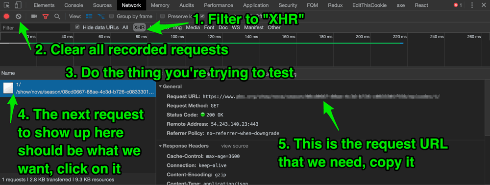

I don't write a lot of end to end (e2e) tests. However, for one project at work, we have a handful of them, and we write them using Cypress. Cypress is a great e2e test framework that is very intuitive for people coming from a JavaScript background.

In particular, I was writing an e2e test for an interaction that required an ajax call / response, and found the [existing Cypress documentation](https://docs.cypress.io/guides/guides/network-requests.html#Testing-Strategies) … lacking. It is _full_ of unspoken assumptions and one glaring omission.

I'm writing this post mostly as notes to myself in the future, but I hope this walk through helps someone else out there.

## What are fixtures? Why should I care?

Fixtures are blobs of hard coded data, usually recorded from an actual network response. (You could write your own by hand, but I imagine it'd be quite painful.)

If you are trying to test functionality that relies on a network request, test frameworks can artificially insert this fixture data while running the test. The insertion of fake data like this is referred to as **stubbing**. This has many advantages for tests:

- They remove the reliance on a functioning network to make the test work
- You can write tests knowing that the data won't change
- It speeds up tests, since you're not actually waiting for a network response

## What place do fixtures have in Cypress?

Fixtures will only be useful in something like Cypress if you are stubbing in _front end_ network requests (read: xhr / ajax). Cypress runs a browser instance and then tests what happens in that browser.

You cannot stub server _backend_ network requests. (You can do this in separate backend integration tests, but then you are not testing browser behavior.)

In other words — if you have a server side rendered site, this won't help you much.

## Okay, I want to test a front end interaction with an AJAX call. Now what?

So you've identified a piece of functionality that you want to test, and it depends on an AJAX / XHR call in order to work. Here is roughly the steps you will go through:

1. Identify which XHR requests is being made with this interaction
2. Intercept the response from that request and write it to a fixture
3. Configure your test so that it knows to insert this fixture when a particular XHR call is being made as part of the test

(This is what I found so frustrating about the [Cypress docs](https://docs.cypress.io/guides/guides/network-requests.html#Testing-Strategies) on this. In that whole page, it basically covers step 3 above. At no point do they explain _how to generate a fixture_, they just explain how to _use_ it.)

## Step 1 - Identify which XHR requests is being made with this interaction

The easiest way to figure out exactly _which_ XHR call to record is to use your browser's developer tools Network tab. The screenshot below will be from Chrome, but other browsers have very similar functionality. So, with that tab open:



1. Filter to only **XHR** network requests
2. Clear all recorded requests that have already loaded
3. Perform the interaction that you're looking to test (clicking on the button, changing a select, etc)
4. You should see a new XHR request in the network tab, click on it
5. Note the full **Request URL** - we will need that in a second, so, copy it

## Step 2 - Intercept the response from that request and write it to a fixture

This is the glaring omission made in the Cypress docs. I literally found out how to do this from some [Github issue comments](https://github.com/cypress-io/cypress/issues/1266#issuecomment-363907598). Apparently, this steps seems obvious to a lot of people — well, I can tell you, it is _not obvious_.

I'm going to assume that you already have Cypress [installed in your project](https://docs.cypress.io/guides/getting-started/installing-cypress.html#System-requirements). Let's create a test for, say, a widget component (the actual kind of component isn't important).

We'll create a test file in the `cypress/integration` integration directory. Call it, say, `widget_spec.js`. You will need to start off with a basic test like this:

```javascript
// cypress/integration/widget_spec.js

describe("Testing the widget", function() {
  it("Widget does something with AJAX / XHR", function() {
    // stuff will go here
  });
});
```

**This is the magic part.** At this point you can write a temporary function that will make the network call in question, and then write that response to a fixture file.

```javascript
// cypress/integration/widget_spec.js

describe("Testing the widget", function() {
  it("Widget does something with AJAX / XHR", function() {
    // this function will be temporary
    // using cy.request, we will ping the
    // Request URL that we copied earlier
    cy.request("https://request-url-from-step-1-above/example/").then(
      response => {
        // then use the response.body to write a fixture.
        cy.writeFile("cypress/fixtures/widget.json", response.body);
      }
    );
  });
});
```

You can organize fixtures however you want, but they should live in the `cypress/fixtures` directory.

Now, actually _run_ Cypress and run the current spec file's tests. Cypress will now create a fixture file (in this example, `cypress/fixtures/widget.json`). **That is the fixture we will now use in our test.**

You can look at it — it's just a JSON file. For this example, let's say it looks like this:

```JSON
// cypress/fixtures/widget.js
{
  "title": "The title of the widget based on the XHR fixture data"
}
```

## Step 3 - Configure your test so that it knows to insert this fixture when a particular XHR call is being made as part of the test

Now that we have a fixture file in hand, we can write a test that stubs that response in when an XHR call is made.

First, _delete the function that we wrote before_.

Now, writing a test to use the fixture looks like this:

```javascript
// cypress/integration/widget_spec.js

describe("Testing the widget", function() {
  it("Widget does something with AJAX / XHR", function() {
    // sets up cy.server, so cypress knows to
    // prepare network responses
    cy.server();
    // this is where we tell cypress to intercept
    // certain XHR calls,
    // and to stub in our fixture instead
    cy.route({
      // our example is a GET call, but you could also
      // have a POST, if you're pushing data up
      method: "GET",
      // more on the URL below
      url: `https://request-url-from-step-1-above/example/`,
      // the fixture: shortcut will know to
      // look in cypress/fixtures,
      // unless you configure cypress to
      // put it somewhere else
      response: "fixture:widget.json"
    });
    // all this does is load the path where our widget is,
    // but it has to come after cy.server and cy.route
    cy.visit("/path-to-page-where-widget-appears");
    // using a CSS selector, in this case a class name,
    // make sure there is at least one widget
    cy.get(".widget-selector").should("have.length", 1);
    // from here on out, you can write your test as needed
    // in this example clicking the widget button
    // kicks off the XHR request
    cy.get(".widget-button").click();
    // our fixture data will come back,
    // so we can write tests to make sure
    // data is getting displayed in some
    // manner that we expect
    cy.get(".widget-title").contains(
      "The title of the widget based on the XHR fixture data"
    );
  });
});
```

## Configuring cy.route and the URL

In our example above, I had this configuration:

```javascript
cy.route({
  method: "GET",
  url: `https://request-url-from-step-1-above/example/`,
  response: "fixture:widget.json"
});
```

First `https://request-url-from-step-1-above/example/` is an absolute URL. You will need this if your XHR call is to outside site, but, if it's an internal AJAX call, you can start with `/`, like so:

```javascript
url: `/example/`,
```

This is okay, if the URL is only ever one path, and it never changes. Thankfully, we can use wildcards.

```javascript
url: `/example/*`,
```

**This was one of the tricker things that I ran into**. Depending on the depth of the path, you may need to experiment with which pieces of it you can or cannot wildcard in order to get stubbing to work.

Let's say it's more complicated, like

```javascript
url: `/users/123/profile/emailprefs`,
```

Using a blanket wildcard like this may not work:

```javascript
// does not work
url: `/users/*`,
```

But with some trial and error you may find that something like this works:

```javascript
url: `/users/*/profile/*`,
```

I wasted a lot of time trying to get stubbing to work, only to find that my `url` wildcard needed to be more specific.

## Conclusion

I hope this helps you write some fixture driven e2e tests in Cypress. If it does, please let me know with a comment below!
