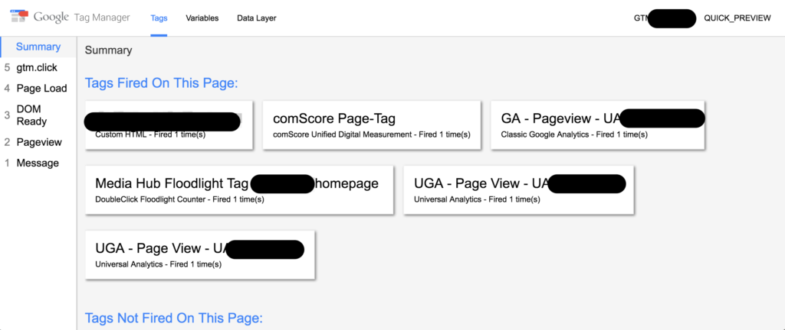

A quick, but super useful tip, if you’re spending a lot of time creating tags in Google Tag Manager on click events.

<!--more-->

Assuming you have the Google Tag Manager Console open (by having your container in 'preview' mode) - have you wanted to be able to click on something, and see what tag fires, _without going on to the page/URL that you just clicked_?

If you’re on a Mac, **simply hold the command key while clicking on the link** that you’re trying to test your tag on. (I assume the Control key will do the same on Windows) This will:

- Prevent the page from loading the clicked URL
- Show you what tag fired in the Google Tag Manager console
- Still register 'real time' events in Google Analytics, if that is what you’re using

I’ve not seen this idea documented elsewhere, so I hope this is useful to others.
