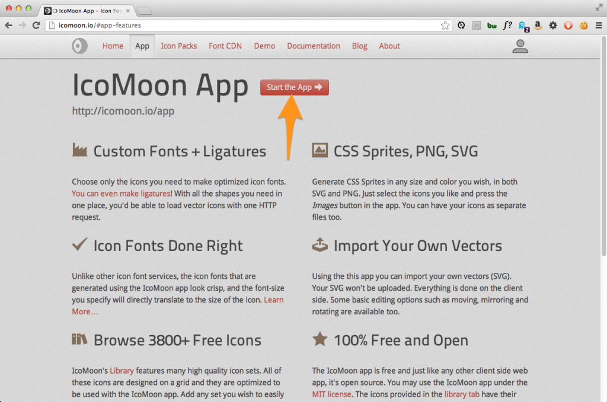
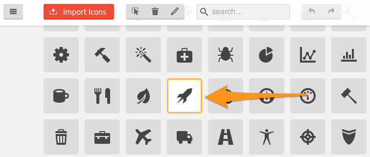
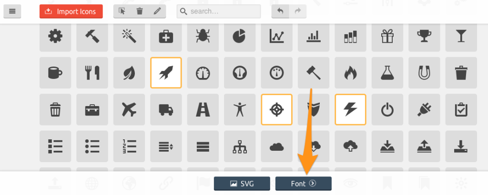
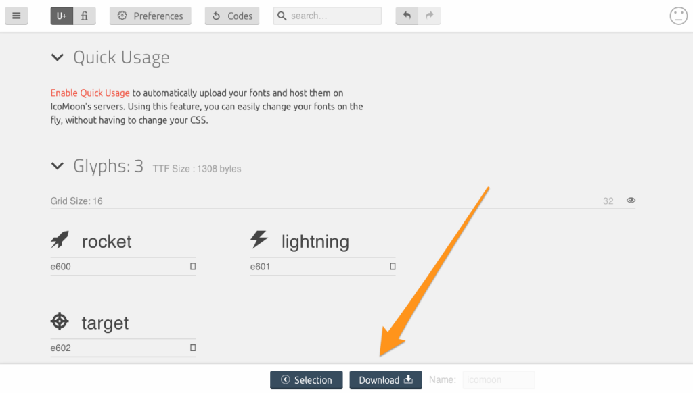

_Note: This post was updated on December 18th, 2013, to use new screenshots that show the recent redesign to the IcoMoon App._

I've become a huge fan of [using icon fonts recently](/using-icons-from-icon-fonts-directly-in-css/). I love the fact that graphics elements that are implemented this way are vector based & stylable with CSS. It makes them really easy and flexible to work with.

One of the things that you will have to confront, though, is how to actually _get_ an icon font that you can use. That is where [IcoMoon](https://icomoon.io) comes in. It is an online service that lets you **generate a _custom-built_ icon font**, using icons that are either open licensed or for-pay.

I've used IcoMoon on a couple of projects lately, and wanted to share what I've learned. I'm going to break this into three seperate posts:

- How to use IcoMoon at a basic level
- [How I've used it in a workflow](/how-to-use-icomoon-and-icon-fonts-part-2-a-workflow/)
- [Share some ninja-level tricks to really get the most out of it](/how-to-use-icomoon-and-icon-fonts-part-3-7-ninja-tricks/)

<!--more-->

## Audience

These articles are intended for front end developers, or anyone who is in the business of actually creating working HTML & CSS for websites.

### Assumptions

I'm going to assume that you know how to write HTML and CSS to a fairly high degree. The concept of [attribute selectors](https://css-tricks.com/attribute-selectors/) is not foreign to you.

### What I won't cover

I'm not going to cover how to create a font from scratch - there are libraries full of books on just that subject. This also isn't a primer on drawing icons themselves.

## To the moon, Alice: Launching IcoMoon

The IcoMoon site actually has a few facets to it - you can download packs of vectors files to use in design work. To use the font generator, you need to click on the "App" link, then the "Launch App" button.




Now - the fun part - picking out icons! Take a look at the default set of IcoMoon icons and see if anything strikes your fancy. In my case, I want to use this rocket ship:



Go nuts! Pick out as many icons as you want to use, or have use for. My icon fonts tend to end up in the 20-30 icon range.

_Be sure to read [the third part of this series](/how-to-use-icomoon-and-icon-fonts-part-3-7-ninja-tricks/) for some ninja level stuff you can do at this stage_

## Generating the font

When you've added all the icons that you want, you need to click on the font button at the bottom of the screen to get ready to generate a font:



This takes you to the "Font" screen, which shows you every icon that you've selected, as well as the unicode character for it (more on that in a bit).



Now click "Download" and IcoMoon will kick out a zip file, with your custom icon font(s) in it.

### What you get


IcoMoon gives you a few things when it generates your font -

- A **"fonts" directory** that actually contains the generated font files
- **demo.html** is a useful HTML file that you will want to keep a hold of for reference
- A **demo-files** directory - this is just extra stuff needed by demo.html - you don't really need to worry about it
- **style.css** - used by demo.html, as well as the CSS you will need to incorporate into your project in order to use your icon fonts.
- Read Me.txt - just what it says
- _NEW as of Fall 2013 -_ **selection.json** - A file that contains your choices and configurations, which can be uploaded to IcoMoon if you need to revise your font later. (Author's note: I'm _very_ happy that this comes by default now)

The way I generally roll is to have a directory in my project, on the same level as /css/, called 'fonts', and I drop this whole IcoMoon folder into it. Then I _copy_ the four font files that I need and put those copies into the top level of /fonts/.


Why copy? You will see in [part 2](/how-to-use-icomoon-and-icon-fonts-part-2-a-workflow/).

## Using your icons

In order to actually use the icons in your icon font, you will have to 1) add your icon font via CSS and 2) insert your icons.

If you open the provided style.css from IcoMoon, you will see the `@font-face` rule that you will need:

```css
@font-face {
  font-family: "icomoon";
  src: url("fonts/icomoon.eot");
  src: url("fonts/icomoon.eot?#iefix") format("embedded-opentype"), url("fonts/icomoon.woff")
      format("woff"), url("fonts/icomoon.ttf") format("truetype"), url("fonts/icomoon.svg#icomoon")
      format("svg");
  font-weight: normal;
  font-style: normal;
}
```

You will need to adjust the paths to the font files to suit the relationship between your CSS file and your font files. I almost always have to insert '../' into the font path in my projects:

```css
src: url("../fonts/icomoon.eot");
```

To insert your icons, you can go about it two ways:

### Inserting icons as elements in HTML

The majority of the time, you will be inserting new pieces of markup. The trick is to have a data attribute attached to your icon element. The convention suggested by IcoMoon is to use a `<span>` with a 'data-icon' attribute:

```html
<span aria-hidden="true" data-icon="&#xe001;" class="down-arrow"></span>
```

You could just as easily use an `<i>` element as has been suggested elsewhere. The key is the data-icon attribute, and it's contents.

That is because, if you look at the downloaded style.css, in order to have your icons show up, you need a piece of CSS that looks like this:

```css
[data-icon]:before {
  font-family: "icomoon";
  content: attr(data-icon);
  speak: none;
  font-weight: normal;
  font-variant: normal;
  text-transform: none;
  line-height: 1;
  -webkit-font-smoothing: antialiased;
}
```

What this does is target any element that has the `data-icon` attribute, and using the `:before` pseudo element, inserts whatever the _contents of that attribute_ actually is. Just be sure to use the right HTML entity for the icon you want, which you can figure out by looking at the provided index.html.

## Using pseudo elements

I've kind of covered this [previously](/using-icons-from-icon-fonts-directly-in-css/). If you find yourself in a situation where altering your markup is difficult (and you aren't worried about IE < 8), you can insert icons via `:before` or `:after` pseduo elements. The trick is to just 'escape' the HTML entity that references the icon you want:

```css
.foo:before {
  content: "\e001";
  font-family: "icomoon";
  speak: none;
}
```

You can then style this however you want - with font size, color, css transitions, etc.

So that is a basic run down of how to get started with IcoMoon. Be sure to catch the [next part of this series](/how-to-use-icomoon-and-icon-fonts-part-2-a-workflow/) where I will go over the workflow that I've found works (for me) when working with IcoMoon's icon fonts.
