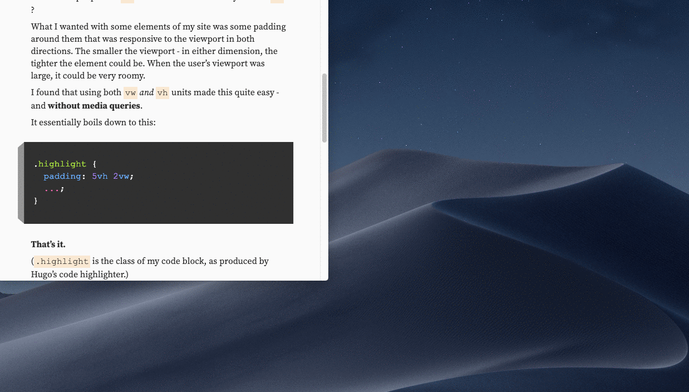

With my new design, one of the things that I explored was using some CSS units that I hadn't before, and seeing what I could do with them.

One of the more interesting things that I discovered was how easy it was to make spacing between elements act in a responsive way.

## vw / vh units

Now, `vw` and `vh` units have been around for a while now, so they weren't necessarily _new_. But I think it's fair to say that most of the time people use `vw` — when was the last time you used `vh`?

What I wanted with some elements of my site was some padding around them that was responsive to the viewport in both directions. The smaller the viewport — in either dimension, the tighter the element could be. When the user's viewport was large, it could be very roomy.

I found that using both `vw` _and_ `vh` units made this quite easy — and **without media queries**.

It essentially boils down to this:

```css
.highlight {
  padding: 5vh 2vw;
  ...;
}
```

**That's it.**

(`.highlight` is the class of my code block, as produced by Hugo's code highlighter.)

The above is basic CSS shorthand for padding — `5vh` is the top and bottom padding, and `2vw` is the left and right padding.

What that allows for is narrower or wider spacing based on the viewport — in _either_ direction.



If you can, resize your browser and notice the effect on the above code block — that's the CSS that I actually use for it.

### Lessons learned from vw / vh as padding units

- If you maintain a consistent value (such as `5vh`) across elements, you can maintain a consistent look and feel that reads as intentional. Even if you are letting go of control of exactly _how much_ space is being used.
- I found that this works well for padding, but _not_ for margins between elements. I experimented with using viewport units there, but ultimately reverted back to fixed units. I need to explore that more.

## ch unit

The `ch` unit has been around for a bit, but you rarely come across it. I think the use case for it isn't exactly straight forward. The first thing that sprung to my mind was that you could define text [content width](https://practicaltypography.com/line-length.html) — but you should [know what you're getting into](https://meyerweb.com/eric/thoughts/2018/06/28/what-is-the-css-ch-unit/).

I went about using `ch` in this way:

```css
@media (min-width: 768px) {
  grid-template-columns: 3rem 40ch minmax(20ch, 30ch) 1fr;
  grid-template-areas:
    "header header header ."
    ". content content ."
    ". tags tags ."
    ". comments comments ."
    ". footer footer .";
}
```

At an arbitrary breakpoint (I used `768`, but it could have been whatever), I decided I would have two columns for my main content well. I wanted two columns for flexibility down the road. The first would be a fixed 40ch wide, while the second would flex between 20 and 30ch wide.

So, I would essentially have a content well that would be _between 60 and 70ch wide._

This, to me, got my content well to stay roughly within what I perceive to be the sweet spot of line length in my content.

If the user ups their type size, my content well will grow proportionally. That would also be true with `em` or `rem` units, but now I can easily swap out typefaces and know that my content well will adjust to _it_ as well.
