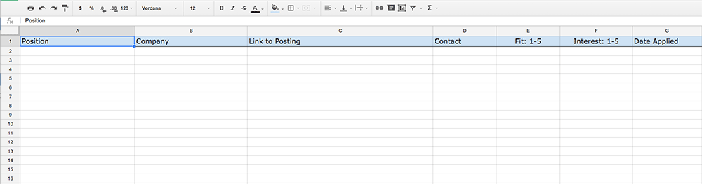

Job hunting can be a messy, unorganized process.

After [getting laid off](/surviving-getting-laid-off), I found that there were a lot of things that I did which made me stay focused and productive when it came to my job hunt. I can't say that any one of these ideas directly led to my new job, because it came in a way I didn't expect.

The biggest lesson I can share with you would be to **keep an open mind**. You can't predict where your new job will come from, or who will open that door. It could be that an opportunity might not meet some criteria that you set for yourself. Explore it, though, and see if there is a way that you can make it fit your needs.

These are the things that I did that helped me, and I hope they can help you:

<!--more-->

## Keep your routine

As I mentioned in my [previous post](/surviving-getting-laid-off), it's important to keep your routine, even if you're no longer going to an office. This is why.

**Your new job is finding a job.** You need to be working at it every day, just like any other job.

My routine stayed largely the same, mostly because I had kids that still needed to get to school / daycare. It usually went something like this:

- Get up at my normal time
- The morning routine of getting dressed, breakfast, etc
- Take the kids to school
- Come home and work on the job search for 2-3 hours
- Go for a run & have lunch
- Work on a new skill, or do a project
- Pick up the kids from school

## Define your job criteria

You need to figure out **what kind of job you really want to get**. If you can define it in concrete terms, you can steer your effort towards that goal.

Even if you were let go suddenly, and find yourself needing a new job as soon as possible, you _need_ to define the criteria of your new job.

If you have clear criteria in mind, you will be able to wade through job listings with greater focus. You will know much more quickly which jobs are worth your time investigating.

If you _don't_ have clear criteria in mind, you risk wasting a lot of time going on interviews for jobs you don't want. Or worse, you'll end up feeling backed into taking a job you hate.

I went for a run right after being laid off and thought about what I wanted in my next job:

- A senior front end developer position
- A definite need for work / life balance
- Heavy preference for working from home

I left out a lot of technical specifics as criteria for a job. I wasn't looking for a job with "x" programming language or "y" framework. That stuff comes and goes. Work-life balance is either part of a workplace culture or it isn't.

## Make a checklist of updates

Now you need a concrete set of tasks to get yourself going. There can be a surprising amount of items that you will need to create or update in order to help your job search. It can feel a bit overwhelming, so **make a checklist you can work through.**

Here is are the things I worked on:

- Updating my résumé
- Updating my LinkedIn profile
- Updating my GitHub profile with code samples I could send at a moment's notice
- Adding a profile to industry-specific job sites

All of that can take several days, if not a week or more. It is also an iterative process - I continuously updated these items during my job hunt.

## Find an editor

We all struggle with writing to some degree, and writing about yourself is even harder. **You need an editor** who can look at your résumé, website or other writing in an objective manner.

I was lucky. I have a friend who is a fantastic editor — she does it for a living. She went through a couple rounds of changes to my résumé with me, for which I'm very grateful. She pointed out (rightly so) that I wasn't giving concrete examples of what my responsibilities were. I heeded her advice and ended up with a far, far stronger résumé because of it.

If at all possible, find someone who knows you personally. They will be able to point out where you might be selling yourself short.

As a last resort, there are online services that will do resume reviews, but I can't vouch for them.

## Make a list of job sites you routinely check

If you find a certain set of websites that have the kind of jobs you're looking for — make a list of them so you remember to **check them all, every day.** I would even suggest creating a folder of bookmarks in your browser with all of those sites — so you can quickly get to all of them.

For front end developers, I suggest these sites:

- [Authentic Jobs](https://authenticjobs.com/)
- [We Work Remotely](https://weworkremotely.com/)
- [Codepen Jobs](https://codepen.io/jobs)
- [LinkedIn](https://linkedin.com)
- [Jobspresso](https://jobspresso.co/)
- [Stack Overflow Careers](https://careers.stackoverflow.com/jobs)
- [GitHub Jobs](https://jobs.github.com/positions)

## Keep an organized list of jobs you find and apply to

After a couple days of browsing job listings, it can get very confusing, very fast. It can seem like an amorphous blob of things you are trying to track. You need to **keep an organized list of the openings you find.**

A [Google Spreadsheet](https://www.google.com/sheets/about/) is perfect for this. Each row would be a lead, with the columns being facets of each. I suggest these columns:

- Position title
- Company
- Link to the posting
- Do you know anyone at that company?
- Based on the job listing, how well do you think you fit the requirements? 1-5, with 1 being highest
- What is _your_ interest in the job? 1-5
- Date applied

I found the two "ranking" columns to be particularly helpful. After wading through dozens of listings, it can be hard to remember what your "read" of a job listing was. It makes it very clear which jobs were the best — if they are "1 & 1" you know it's one you want to apply to soon, while also taking the time to craft good cover letters/introductory emails.

[I'm posting a blank template for the job search spreadsheet here](https://docs.google.com/spreadsheets/d/1LO7N0ZUC4Y6GPLfc7gmA8gjMBzDCyGZq3lw-XZZO6R4/edit?usp=sharing) — please take it, copy and modify to your heart's content. I would love to hear if it helps you.

## Conclusion

I ended up getting my new job through a recruiter — which I was definitely _not_ expecting. You have to keep an open mind about where your next job will come from. You need to stay organized, focused, and spend your time wisely. I hope these suggestions help you have a great job hunt.
