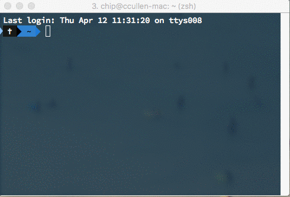

Last year, after getting a promotion, I found myself suddenly in charge of a lot more back end python code. As someone who had almost exclusively worked in the front end (except for some PHP when dealing with Drupal or WordPress) this was new territory for me.

I’ve decided to jot down a few things that I’ve learned that I hope will help folks in a similar position. This is by no means for anyone with even intermediate python knowledge. I’m sure a lot of this will seem super obvious to a lot of folks.

But, if you’re like me and have spent most of your time in the front end, I hope this will orient you a bit.

<!--more-->

## Living interpreter

One of the first things that was disorienting to me was that in Python, you can have a terminal window open, running a script, and it is actually a _living interpreter_. That is you can actually interact with your script and make _real changes_.



This is quite a bit different from a browser console, where you typically only read data; or if you do interact with it, it’s in a temporary way.

## White space means something

If you’ve worked in the front end for years, you’re very conditioned to not worry about white space when it comes to the functionality of your code.

Well, in Python _white space means something_.

White space is how block level is determined. Getting it wrong is actually a _syntax error_ that can cause your script to break.

```python
def functionOuter():
    return True

    def functionInner():
    return True # will break your script
```

While I’m sure this is laughingly obvious to anyone who has written Python for more than an hour, it’s truly strange for a front ender.

## Named arguments

One of things that I _love_ about Python is that functions can have **named arguments**. That means your calling function can pass _only_ the arguments that are relevant, and in an intuitive way:

```python
def functionWithNamedParams(
    param1,
    param2,
    param3=default
):
    # does stuff
...
def callingFunction():
    return functionWithNamedParams(
        param1='foo',
        param2='bar')
        # the third parameter doesn't need to be specified
```

Note that `param3` has a "default parameter value" - which is a fallback in case it’s not specified. [You can read more about it here](https://docs.python.org/3/reference/compound_stmts.html#function-definitions).

## Breakpoints

Something I found myself needing in very short order was a way to stop a long, complex script so I could get in there and figure out what was happening at a given step.

Coming from a JavaScript background I was happy to find out that you can insert breakpoints and take a look around.

I usually throw this in at the point I want to break:

```python
import pdb; pdb.set_trace()
```

Which will import `pdb` - the Python Debugger, then _enter_ the debugger at that point in your code.

Want to inspect the state of a variable (let's say it's called `foo`) at that point? In your _shell_, enter

```python
pp(foo)
```

when you've hit the breakpoint. This will “pretty print” `foo` - which is especially handy if foo is a long object of some kind.

If you have control over the python packages you install, there is a nicer version of `pdb` called [ipdb](https://pypi.python.org/pypi/ipdb).

## If, else and conditions ending with colons

I don't know why, but this syntatical difference took me a while to get used to:

```python
if condition == true:
     # do stuff
else:
     # do other stuff
```

I keep wanting to put in brackets, but no, it's colons. But, I get it. However, there is one thing I do not get …

## Elif

One of the things that I _absolutely loathe_ about Python is this syntactical detail - when writing an else if statement, you write it as `elif`.

```python
if condition == true:
     # do stuff
elif other_condition == true:
     # do other stuff
else:
     # do other other stuff
```

Which is different from pretty much every other language that I’ve experienced, anyway.

I’m not sure why it gets stuck in my craw so much. I’ve been told that there is a reason for it.

I just think it’s _stupid_ - it’s unintuitive and hard to remember if you’re jumping between languages a lot. Is `else if` really so hard?

## Objects vs Arrays :: Dictionaries vs Lists

Data is stored in a few different ways in Python, among the most commonly used are:

### Dictionaries

Dictionaries are most easily equatable with JavaScript objects, for the simple fact that they have key/value pairs:

```python
iAmADictionary = {
    key: 'value',
    otherKey: 'otherValue',
    nestedDictionary: {
        nestedKey: 'nestedValue',
    },
    hereIsAList: [0, 1, 2, 3],
}
```

Note the last line in a dictionary can have a trailing comma `,` which is different from JSON / JavaScript objects.

Another thing to note about dictionaries is that Python did _not_ maintain their order prior to version 3.6. Before that version, keys/values can get returned in any order.

### Lists

Lists, on the other hand, are closer to what we think of as Arrays in JavaScript:

```python
iAmAList = [0, 1, 2, 'three']
```

Lists _will_ maintain their order, and can use mixed data types.

There are actual things called "arrays" in Python, but they are something else, and have a very specific use-case. For the vast majority of the time, you’re never going to have to deal with them - you’ll be dealing with _lists_.

## Getting something by key

You can get at information in an obje... I mean _dictionary_ in a couple different ways. This will look familiar to JS folks (using our dictionary from earlier):

```python
iAmADictionary['nestedDictionary']['nestedKey']
# returns 'nestedValue'
```

The one drawback here is that if any of the keys don't exist for some reason, you will raise a `KeyError`.

This is also a way to get data in a dictionary:

```python
iAmADictionary.get('nestedDictionary', {}).get('nestedKey', 'someDefaultValue')
# returns 'nestedValue'
```

So, instead of square brackets, we can use `.get`, which can optionally be given a default fallback value.

One … (wait for it) … key difference is that `.get` won't raise a `KeyError` if the key isn't present, it'll just return `None`. (Which is usually why you get errors that say something about `NoneType` a lot.)

## Try / except

If you've used `try ... catch` in JavaScript, Python has something like it, but it's a little better in that you can specify errors that you respond to.

```python
try:
    # try to do something
except KeyError:
    # do something if there is a KeyError
except ValueError:
    # do something else if there is a ValueError
except:
    # handle any other errors
```

### Raise

You can also force a specific error at a specific place, if you want:

```python
if num < minimumAcceptedValue:
    raise ValueError('Number does not meet minimum!')
```

## Decorators

I'm not going to go all the way into it, but decorators are a weird animal. It's basically a bit like calling another function, from a function, and passing the second function as an argument.

```python
@decoratorFunction
def anotherFunction():
    # do stuff
```

Is another way of saying

```python
anotherFunction = decoratorFunction(anotherFunction)
```

There's a lot more to it, and you have to jump through certain hoops to make decorators, but that's the concept in a nutshell.

## Thank You

Thanks to Chris MacDonald, Julia Rose and James Turk for feedback on this article, and to Carl Johnson for the idea of including decorators, because yeah, they're weird.
