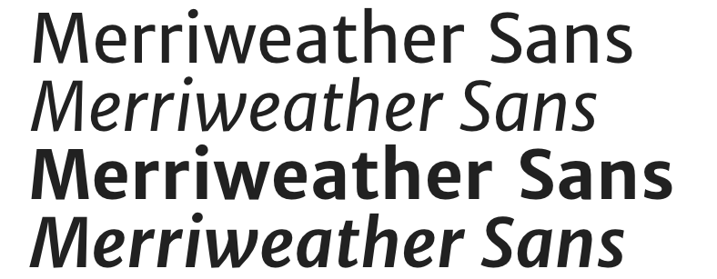
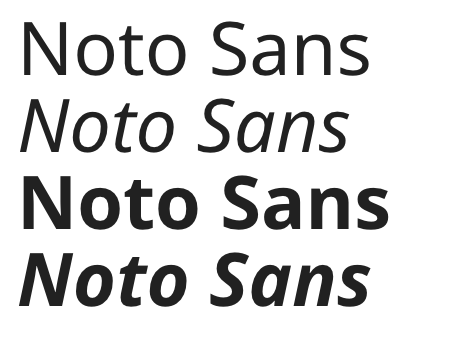
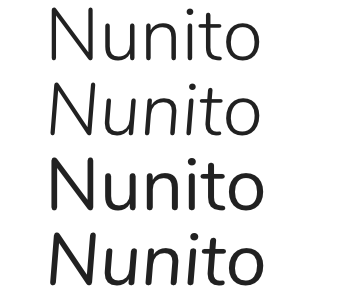
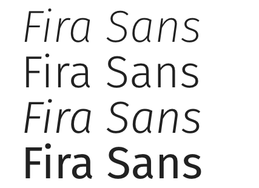

Design Systems expert [Nathan Curtis](https://eightshapes.com/nathan-curtis.html)\* tweeted this the other day:

<blockquote class="twitter-tweet" data-lang="en">
With all those typefaces out there, how do my systems clients usually end up with Proxima Nova, Open Sans, or Source Sans Pro?
&mdash; Nathan August Curtis (@nathanacurtis) <a href="https://twitter.com/nathanacurtis/status/841964283562987520">March 15, 2017</a></blockquote>

This got me thinking - anecdotally, those three typefaces have been the ones primarily used on every project that I've worked on for maybe the last four or five _years_. This very blog is (currently) set in Source Sans Pro. It's impossible to compile statistics on this (or is it?), but it his statement rings true in my experience.

_Why_ do those three typefaces - Proxima Nova, Open Sans, our Source Sans Pro - seem to rule the web? What are there any pitfalls of using them? What do they have in common? What should we look for in alternatives? What are some example alternatives we can consider?

<!--more-->

## What are the pitfalls of using these typefaces?

1. **Sameness** - If we're all using the same typefaces, our projects all tend to have a similar voice. When a typeface becomes so common, it tends to loose all 'voice'. I think Proxima Nova has reached this particular zenith - it's now almost as bland as Helvetica once was. That's through no fault of the typeface itself - it's the result of its popularity.
2. **In reaching for the familiar, we don't consider what might be best for the job** - I think these three typefaces are some of things that designers instinctively reach for at this point. However, what I think gets overlooked is whether or not one of those typefaces is the right choice for a particular project. Are you working on a web app that mostly has interface elements? Then don't pick a typeface because it looks good when used in headlines.

## What do these three typefaces have in common?

1. **They're Sans Serifs** - Let's get the obvious out of the way. All three typefaces are sans serifs, which have traditionally been held as the better choice for body copy on digital screens. It's a view that I've long held.
2. **They offer a wide range of weights** - This is the primary reason I think they are so common in design systems. These are very robust typefaces in that they offer a great many weights, usually with accompanying _italics_. That makes it very easy to build out a whole system with a unified typographic feel.
3. **Specifically they offer a very light weight** - I think that visually designers are drawn to very light weights of typefaces because it allows them to make large headlines that still feel elegant. All three of these typefaces provide those weights, and, they look good at larger sizes.
4. **They're not Helvetica (or, gasp, Arial)** - let's call a spade a spade here - they're not system fonts. But, they're still 'safe' choices that hold up to wide use.
5. **They look good at body copy and headline sizes** - Regardless of weight, these three choices look nice at both body copy sizes _and_ italics. Notice I say "good". I think they're above average for both use cases, but not the _best_ for each (I particularly think Proxima Nova is a poor body copy choice). I think a design systems should consider having more than one typeface - one a body copy/interface element typeface, and a 'headline' typeface.

## What should you consider when looking for an alternative?

1. **A wide range of weights, each designed well** - As I said, the primary reason a lot of designers reach for those three typefaces is the number of weights they offer. And, each of those weights is executed impeccably. A range of weights provides easy options that build variety in a system, while still maintaining unity. However, a word of caution: be very judicious in your use of weights. Every added weight represents a significant performance hit. Be sure the weights you use are distinct and useful enough to merit their inclusion.
2. **They look good at the sizes you’re most likely to use** - Most typefaces are designed to be used either on the small side or on the larger side. For example, Verdana was designed for use at small sizes, and looks awfully clumsy at larger sizes (are you listening, Ikea?). Some typefaces even include ‘display’ variations that are distinct from regular fonts, which is the same letterforms, but slightly redrawn with proportions that look good at larger sizes.
3. **Check out serif typefaces** - The idea that sans serif typefaces look better in a digital setting has been around for a while. However, we live in an era of high resolution screens and media queries. Maybe your brand voice would be best represented by a serif typeface (and you can always fall back to a sans serif when the user’s screen doesn’t handle that well).

## What alternatives are out there?

Depending on your system's needs, I would suggest you look at these typefaces, all available from [Google Fonts](https://fonts.google.com):

- [Merriweather Sans](https://fonts.google.com/specimen/Merriweather+Sans)
- [Noto Sans](https://fonts.google.com/specimen/Noto+Sans)
- [Nunito](https://fonts.google.com/specimen/Nunito)
- [Fira Sans](https://fonts.google.com/specimen/Fira+Sans)

1. **[Merriweather Sans](https://fonts.google.com/specimen/Merriweather+Sans)** - Merriweather first started life as a serif typeface, which was later accompanied by this, the Sans Serif. Merriweather has a warm character, and paring the serif and sans makes for easy visual harmony.

2. **[Noto Sans](https://fonts.google.com/specimen/Noto+Sans)** - I've been a fan of the [Noto project ](https://www.google.com/get/noto/) for a long time. I'm frankly surprised it hasn't seen wider use. What is so special about Noto is how _internationalized_ it is. It is by far the most complete typeface out there in terms of accommodating different character sets. Need something translated to Balinese or Urdu? Noto has you covered. For international organizations, this typeface needs a serious look. Keep in mind, though, the Sans family doesn't have the super light weights that designers seem to love.

3. **[Nunito](https://fonts.google.com/specimen/Nunito)** - Nunito is a typeface that I've only recently discovered. And I like it, a lot. It has a modern, Helvetica-esque proportions, but also has warmth. It has the rounded terminals of Proxima Nova, but _isn't_ Proxima Nova. It comes in wide variety of weights, to boot, and has a very attractive Sans Serif (flat terminal) variation.

4. **[Fira Sans](https://fonts.google.com/specimen/Fira+Sans)** - Fira has an impressive pedigree - it was partially developed by Erik Spiekermann. It was developed for use in a digital UI. It has a very impressive range of widths, with accompanying italics. To my eye, it doesn't fare as well at _large_ type sizes (since it was intended for use in UI), but that may not be an issue in your system.

I hope this post helps you recognize why we seem to reach for similar typefaces in systems, and to consider alternatives out there. Have any other typefaces that have worked for you? Leave a comment below!

\* Full disclosure: I worked with Nathan once upon a time. I thank him for his input on this article, as well.
