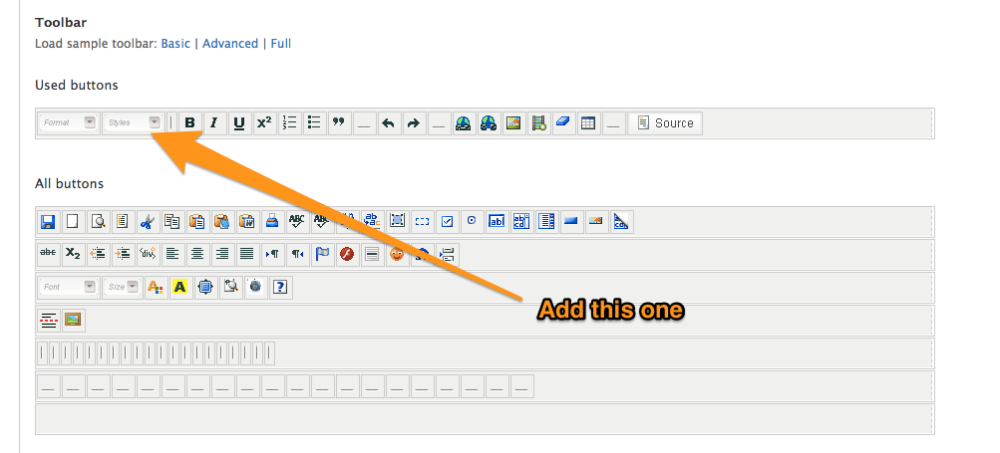
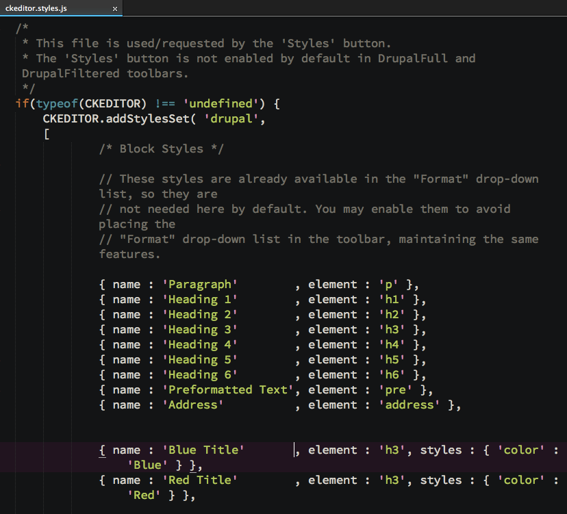
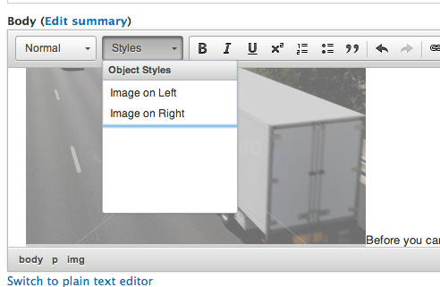
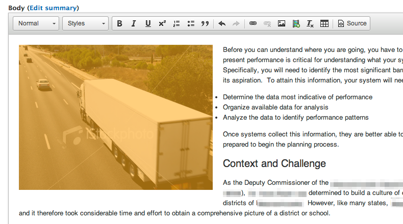
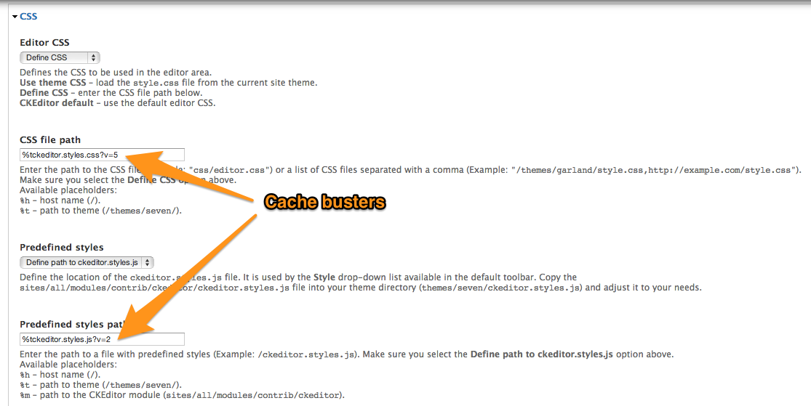

I'm just jotting down a couple things that I figured out recently with regards to making modifications to the [CKEditor WYSWIG editor](https://drupal.org/project/ckeditor) in a [Drupal 7](https://drupal.org/) installation.

On a recent project, we had a client who wanted the ability to have images in the body float left or right. What I wanted to see happen, as a front end developer, is that the images would simply have a class attached to them, and my external CSS would handle the floating.

Why a class (as opposed to inline styling?):

- Cleaner markup in general
- Style attributes were being stripped by our text format, and I didn't want to let _any_ HTML fly within this format
- Just adding a class would make future modifications easier (rather than trying to modify individual instances of inline styles)

After an afternoon of experimentation, I found out you need two files added to your theme, and a weird trick to make sure it works.

<!--more-->

I'm going to assume that you already have the [CKEditor module](https://drupal.org/project/ckeditor) up and running, and the [CKEditor library](http://ckeditor.com/) itself has been installed in sites/all/libraries.

## Adding new style options to CKEditor

The first step is to add the "Styles" drop down to the editor itself.

- Go to Configuration > Content Authoring > CKEditor
- Next to the profile that you want to change, click "Edit"
- then on that page, open the "Editor Appearance" fieldset
- Scroll to the section where you can drag/drop items on the tool bar, and drag the "Styles" box onto your tool bar

Save your changes, but keep the CKEditor page open, as we'll be revisiting it soon.

The first file that you will need to add to your theme is **ckeditor.styles.js**. This is what will dictate what style options appear in the dropdown that was just added to the toolbar.

The default file exists within the contributed module (presumably sites/all/modules/contrib/ckeditor/ckeditor.styles.js). I would suggest copying that file and putting it in the root of your theme.

When you look at the file, you will see that the styles are laid out in a fairly easy-to-understand JSON format.

You can see how styles are described, and even have some visual design applied to them, so they appear a certain way _within_ the drop down.

I didn't want any of these styles, so I commented out almost everything. What I did add looked like this:

             /* Object Styles */
            {
                    name : 'Image on Left',
                    element : 'img',
                    attributes :
                    {
                            'class' : 'align-left'
                    }
            },
            {
                    name : 'Image on Right',
                    element : 'img',
                    attributes :
                    {
                            'class' : 'align-right'
                    }
            }

Which, _when configured_ (see below), will make two options appear in the drop down menu. When an image element is selected, and one of these options are applied, a **_class_ will be added to the image element** - exactly what I wanted!

In order to get Drupal to have your new style options, though, you need to make CKEditor see your new file:

- Go to Configuration > Content Authoring > CKEditor (you did leave that page open, right?)
- Click "Edit" next to the text format that you edited earlier
- Scroll down to the "CSS" Fieldset and open it
- In the "Predefined styles" dropdown, I would suggest that you set it to "Define path to ckeditor.styles.js".

While setting it to "Use Theme ckeditor.styles.js" will do the same thing in theory, in practice it doesn't work the way you expect. There is some nasty caching gremlin in the dark places of Drupal that will read your file once, but simply will ignore future changes. [This issue has been raised](https://drupal.org/node/1543970) for a while, but it's still exhibiting this behavior.

## The weird trick to get around Drupal not seeing changes to ckeditor.styles.js

As noted at the very end of that Issue, a cache busting string will fix this issue. That's why I suggest you define the path to your ckeditor.styles.js. You can set it to something like this:

    %tckeditor.styles.js?v1

(The %t is a wildcard character that points to the active theme.)

And when you make future changes, just update `v1` to `v2` and so on. Drupal **will** see your changes, then.

Once you've defined your path, and hit save (and clear caches, just to be sure), now your custom style options should appear in the CKEditor toolbar. You can now select image elements that have been placed in the content, and apply classes to them via the options created.

You can try it out, and you should see something like this show up in your markup:

    

Which you can now style in your normal theme CSS, to float or do whatever else you want:

img.align-left {
float: left;
margin: 0 20px 20px 0;
}

## Changing the style inside the editor itself

You can also add custom CSS so that the _editor itself_ reflects your style changes. What you need to do is to add another CSS file to your theme called that will be used by the editor.

I would suggest starting out with the default version of the CKEditor file, which can be found at `/sites/all/libraries/ckeditor/contents.css`. I simply copied that over to the root of my theme, and renamed it **ckeditor.styles.css** just to keep the name associated with the javascript file.

Within that file you can modify how the editor appears. You can do things like change the font that is used, the background color, etc. The sky is the limit - you can take it as far as you want.

You can _also_ include styles for the new options that you just made available in your javascript file. I basically copied over exactly what I added to my main CSS file, so that **now when someone selects an image and floats it, it will float within the editor.**

You _will_ need to configure Drupal to see the new CSS, though. Back in the CKEditor Profile page, under "CSS", under "Editor CSS", I would suggest again using Define CSS and using a string with a cache buster, just like the JavaScript file.

So that is basically it. You need a couple files, one piece of voodoo, and now you can let users apply classes to elements within the CKEditor editor.
