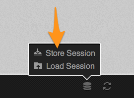

In [part 1](/how-to-use-icomoon-and-icon-fonts-part-1-basic-usage/) of this series, I talked about how to get up and running with IcoMoon, generating an icon font, and using it.

In this second post, I want to get into the workflow that I've figured out that makes working with icon fonts a lot of fun.

<!--more-->

First, before we even crack open a text editor, making a conscious choice to use an icon font will impact design. No matter who is working on the visual design, either you or someone else - if you can agree on using icons in the design that are found on IcoMoon, it will make life _much_ easier.

However, what if just the _right_ icon isn't available? Not to fear: IcoMoon lets you upload your own vector shapes. I will get more into that in Part 3.

Once I have a design direction in hand, and I want to start building an actual site, here is roughly what my workflow looks like:

1. Look through the design and pick out all of the icons used.
2. Go to IcoMoon and generate a font based on those icons.
3. Download the generated font, and _copy_ all four font formats into my `/fonts/` directory, while keeping the folder I downloaded from IcoMoon intact.
4. Start building my site, inserting icons as needed.
5. During this implementation, I keep the **index.html** file from the IcoMoon folder open in a separate browser tab, so I can reference the unicode character strings. This is why I _copy_ the font files out and leave the IcoMoon folder alone - the index.html file won't work if you just move all of the font files.
6. Missed an icon in the design? The client change their mind? Not to worry. You can go back to IcoMoon, and if you haven't changed your font for a new project, you should be able to add/modify icons then re-download your font. I just copy the font files out all over again.
7. You should make an ongoing practice of downloading the 'session' file that IcoMoon makes available, so you can go back and edit your font further on down the line:



Now, I should also mention that the code I showed in Part 1 is kind of a lie. These days I'm writing all of my CSS in SASS, so my actual code looks a little different.

First, in my `_variables.scss` partial, I keep font stacks as variables. So I create one for my icon font:

```scss
$icon-font: "icomoon"; //or whatever your font name is
```

You can also keep your CSS-escaped unicode strings in easier-to remember variables, as well:

```scss
$icon-rocketship: "\e000";
```

Then you insert it via a [pseudo element](/using-icons-from-icon-fonts-directly-in-css/):

```scss
.foo {
  &:before {
    content: $icon-rocketship;
    font-family: $icon-font;
    speak: none;
    font-weight: normal;
  }
}
```

Or, if you include the class name stack from the IcoMoon style.css, you can `@extend` as well:

```scss
.foo {
  &:before {
    @extend .icon-rocket; //found in the downloaded style.css
  }
}
```

One thing that I've done on a recent project was to create an icon font silent extendable class. It looks like this:

```scss
%icon {
  font-family: $icon-font;
  speak: none;
  font-weight: normal;
  font-variant: normal;
  text-transform: none;
  line-height: 1;
  -webkit-font-smoothing: antialiased;
}
```

Which can then be used like this:

```scss
.foo {
  &:before {
    @extend %icon;
    content: $icon-rocketship;
  }
}
```

Easy as vector based pie.

So that is a little insight into how I've ended up working with icon fonts. In [Part 3 I'm going to share some ninja-level IcoMoon tricks](/how-to-use-icomoon-and-icon-fonts-part-3-7-ninja-tricks/) that will show you how powerful the tool really is.
