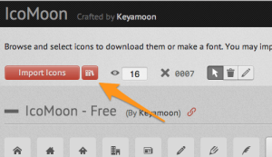
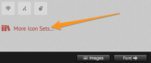
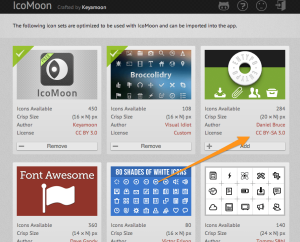
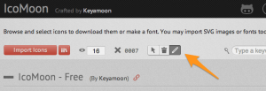
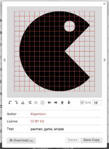
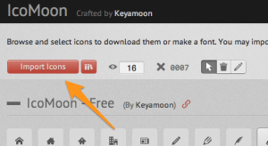
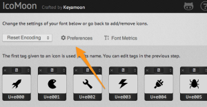
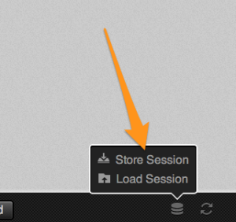

This last of three posts about IcoMoon is going to cover just a few tips and tricks to get the most out of IcoMoon. Some involve the app itself, some are more to do with implementation. Let's get to it!

<!--more-->

## Ninja Trick 1: Adding other icon sets to IcoMoon's app

IcoMoon has several icon sets that you can choose from. When in the 'selection' screen, either click on the "Icon Library" button at the top of the screen:



Or scroll to the bottom and hit "More Icon Sets…"



And select other sets that you want to include.



Some are free and have very open licenses, others cost some money. Usually the ones with CC (Creative Commons) licenses are free to use.

## Ninja Trick 2: Editing icons in your font

Like an icon that you found, but want it rotated the other way? Need it to be 'larger' within the font itself? One of the coolest things about IcoMoon is that it lets you control the icons in your font (to a certain extent). If you are in the 'selection screen' and click the "edit" button



You are now in 'edit mode', which means if you now click on an icon, you get the 'edit screen'



Which lets you:

- Rotate
- Flip
- Scale
- Move

This helped me out a great deal on one project where I inserted an icon, but it needed to be a little bit bigger, but sizing it up with CSS was causing unwanted other effects. By being able to scale up the individual icon within the font, I was good to go.

## Ninja Trick 3: Adding your _own_ shapes to your icon font

As was eluded to in Part 2, what if the shape or icon you want is not available as part of the IcoMoon set (or any of the other sets available)? Not to worry. As long as you have a vector based version of your particular icon, you're in luck.

1. Export your custom icon as an SVG (in Illustrator File > Save As and select "SVG 1.1")
2. In the IcoMoon icon 'selection screen' click the "Import Icons" button



and upload your .svg file

3. You can edit your shape before saving it to your font - just like editing any other icon

Keep in mind that you'll have more luck with black shapes, and if they are as clean as possible when it comes to vector points.

## Ninja Trick 4: Changing the font name

IcoMoon generates your icon font with a default name of 'icomoonxxxxxx'. You can change what the name of the font, in the 'font' screen, by clicking on 'font preferences'



And changing it there. that way you can give your font files a more project-specific name.

## Ninja Trick 5: Downloading your font config file

One thing that I recommend you do after generating and downloading a font is to be sure to download your 'session' file - which you can get at any point by clicking the 'store session' link at the bottom of the screen:



This will download a .json file that contains the information of where your font was when you were editing it - which icons you chose, out of which sets, and any adjustments you made to them. You can keep this file with your project and in version control so you can always go back later, and 'load session' to get back to where you were.

IcoMoon is smart enough to remember where you were when you last used your browser - but if you change computers or browser, it can't know what you were up to. That's why the session file is so important.

In fact, if I had _one_ request of IcoMoon it would be to include the session file by default when you download your font. I've not tried it myself, but theoretically you can actually reimport one of your _font files_ and start work from there, as well.

## Ninja Trick 6: Changing an icon with JavaScript / jQuery

This took me a good hour or so to figure out the other day, so I thought I'd share my lesson. Let's say you have an icon inserted with HTML, and you want to change the icon itself? In my case I was trying to change the icon on a button from pause to play and back again. You have to write the HTML entity a little differently when manipulating it in jQuery:

```html
<a href="#" id="pausePlayButton">
  <span aria-hidden="true" id="playPauseIcon" data-icon="&#xe001;"></span>
</a>
```

```javascript
//jQuery:
$("#pausePlayButton").click(function() {
  $(this)
    .children("#pausePlayIcon")
    .attr("data-icon", "\ue002");
});
```

All we are doing is changing the content of the data-icon attribute, but we need to escape the new value that we're passing with the `\u` at the beginning.

## Ninja Trick 7: Get your SASS on

This doesn't really have anything to do with IcoMoon specifically, but rather implementation of an icon font. As I [covered previously](/how-to-use-icomoon-and-icon-fonts-part-2-a-workflow/), there are some ways to use the power of [SASS](http://sass-lang.com/) to make using icons really easy.

I've taken that even further and created a **['power duo' of an extendable and a mixin](https://gist.github.com/chipcullen/6157025)** that you can use to easily add icons via CSS and keep your final code as lean as possible.

The first part, the extendable "%icon" keeps most of the CSS that you will need to use an icon. By making this extendable, all of the selectors that end up using it are ganged together. That's a lot better than having this stack of CSS get repeated all over the place, causing your final CSS output to be bloated.

The mixin "icon" merely references that extendable, and lets you pass the escaped HTML entity as an argument. You can also optionally include "before" or "after" if you want the mixin to create the pseudo element for you. (The majority of the time you won't use that optional argument, as you'll probably need to apply further rules to the icon).

So now, to use an icon, you can simply write this:

```scss
.foo {
  &:before {
    @include icon("\e001");
    // other rules
  }
}
```

Or if you want to have it create the pseudo element for you:

```scss
.foo {
  @include icon("\e001", before);
}
```

If you really want to go down the SASS rabbit hole, you can even set your icon HTML entities as variables, which will be easier to remember, and easy to change down the line:

```scss
//kept in a variables partial
$icon-rocketship: "\e001";
//-----
.foo {
  &:before {
    @include icon($icon-rocketship);
    // other rules
  }
}
```

Blast off! [Grab the extendable and mixin here!](https://gist.github.com/chipcullen/6157025)

### Conclusion

So this concludes the three part series on IcoMoon and Icon fonts. I will try to follow up in the future with even more ticks that you can use to unleash the power of icon fonts (things like ligatures, mapping different characters, etc).
