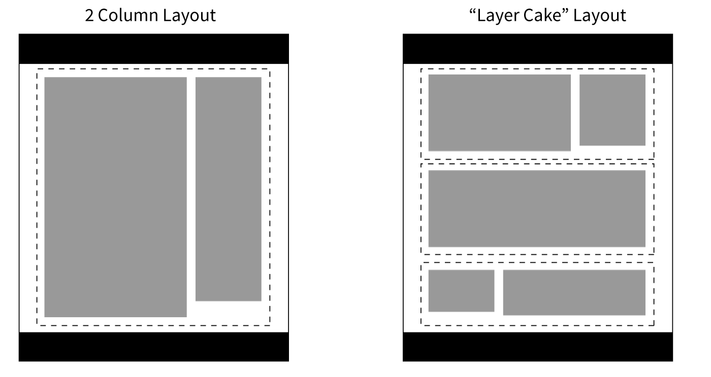
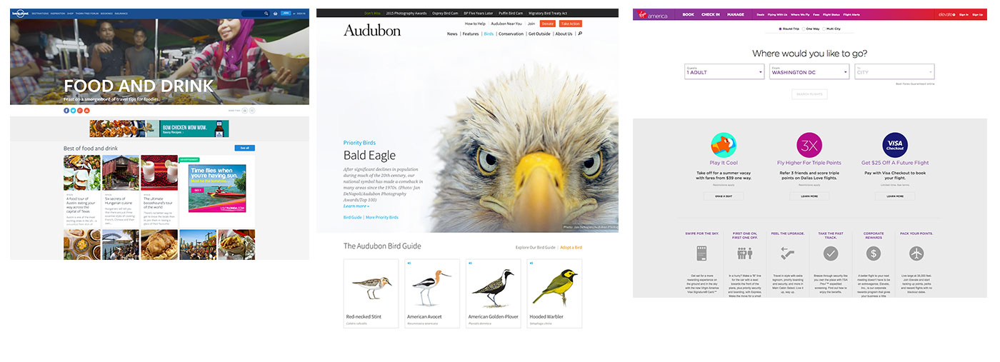
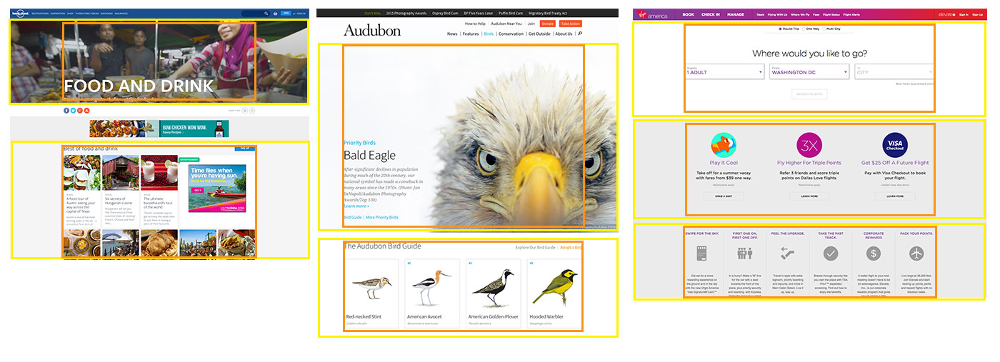

There is a design pattern that I've noticed emerge on a lot of the responsive projects that I've worked on in the last few years. They have all tended to gravitate towards a particular kind of layout. There are a lot of situations where this pattern is helpful, so I wanted to write a bit about it.

I call it "The Layer Cake" - it's _a_ way to approach page layout in a responsive design. You can also call it 'tiered' layout - but, mmmmm - cake. This differs from a regular 'multi column' layout in that there is no all-encompassing container, or long running sidebars. There can be multiple columns _within_ a layer, though.



<!--more-->

Here is what it looks like in the real world:



The layout consists of _independent layers_ that are stacked on top of each other to form the page. A consistent layout is achieved by the use of "inner" containers - even if not visible without viewing the code. Here are the above examples again, but with the layers outlined in yellow, and the inner containers in orange:



If you're thinking about things in terms of code, instead of this kind of source order:

```html
<body>
    <div class="container">
       <div class="column-1">
           <!-- column content -->
       </div>
       <div class="column-2">
           <!-- column content -->
       </div>
    </div> <!-- end container -->
</body>
```

You will end up with markup more like this:

```html
<body>
    <div class="layer">
       <div class="layer__inner">
           <!-- layer content -->
       </div>
    </div> <!-- end layer -->
    <div class="layer">
       <div class="layer__inner">
           <!-- layer content -->
       </div>
    </div> <!-- end layer -->
    <div class="layer">
       <div class="layer__inner">
           <!-- layer content -->
       </div>
    </div> <!-- end layer -->
</body>
```

This approach has several strengths, especially in a responsive design:

- The layers can all be swapped out, moved around, etc - easily. This makes for a layout that is easy to implement as part of a whole **design system**.
- Content source order _must_ be considered carefully, as it enforces hierarchy.
- By avoiding sidebars, you can side step awkward content order problems that arise from a more traditional 2 or 3 column layout.
- It works really well when there are many pieces of varied content being presented - e.g. home pages, category pages
- Long form content will probably end up with large swaths of negative space next to it. I personally think this is a strength that aids in the readability of content, but this could be perceived as a drawback.

Potential drawbacks do exist:

- They tend to end up forming long pages with a lot of scrolling. I personally don't mind this - I think users are by and large comfortable with scrolling.
- "Related" content pieces are harder to present 'right next to' a main piece of content.
- Maintaining a consistent layout involves a bit more planning and manual adjustment.

Have you used this design pattern? What worked well for you? What didn't? Let me know with a comment!
